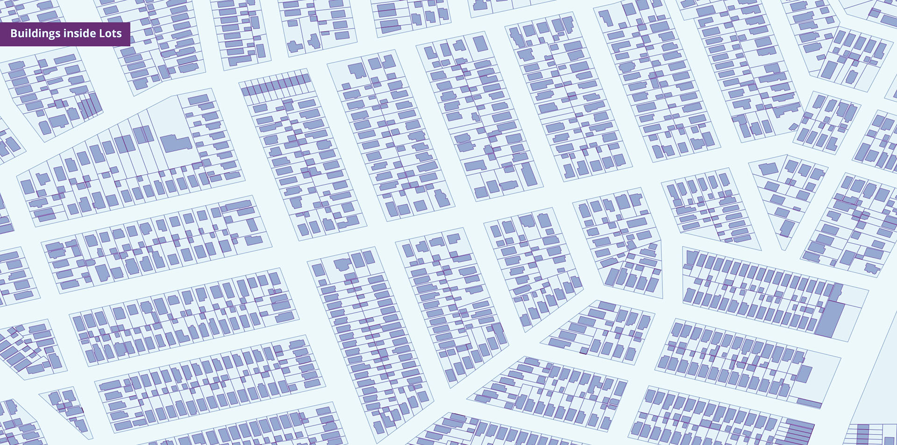
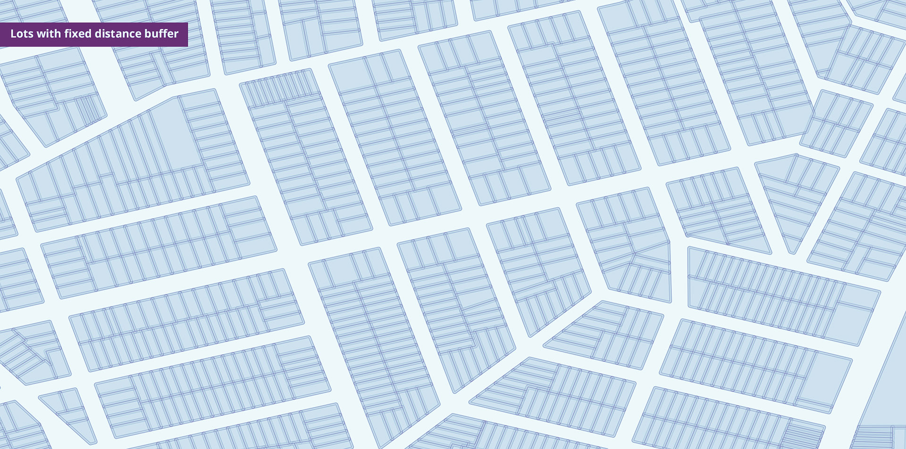
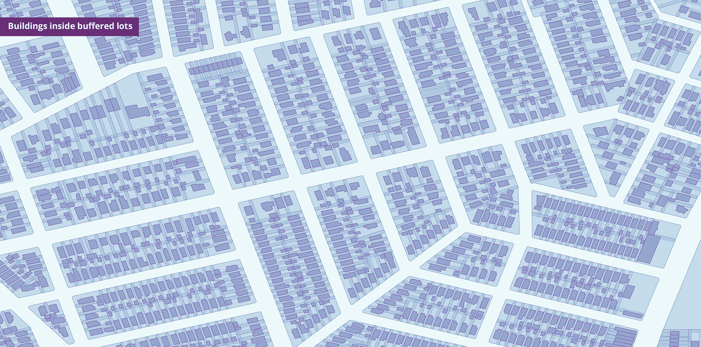

# Spatial Join with MongoDB
Multi-threaded Spatial Join algorithm for spatially indexed data in MongoDB

## Installation
Clone this repository and install the dependencies.

```sh
git clone https://github.com/UrbanSystemsLab/spatial-join-mongodb.git
cd spatial-join-mongodb
npm install
```

## Layer Names
For the following documentation refers to the layers in following manner for ease of understanding.

- **Inner Layer :** `buildings`
- **Outer Layer :** `lots`
- **Outer Layer with Buffer :** `lots_buffer`
- **Output Layer:** `buildings_spatialJoin`

**Note:** Creating a buffer for the outer layer is optional.





## Usage
Once the collections are setup in MongoDB run the following command to perform Spatial Join on collections.

```sh
node init.js --db '[database-url]' --innerLayer [Inner Layer Collection] --outerLayer [Outer Layer Collection] --outputLayer [Output Collection]
```

#### Example
```sh
node init.js --db 'mongodb://localhost:27017/nyc' --innerLayer buildings --outerLayer lots --outputLayer buildings_spatialJoin
```

## Setup and Process

**Optional: Create a buffer for the outer layer**

If the difference between inner layer polygons and outer layer polygons is quite small then a [fixed distance buffer](https://docs.qgis.org/2.6/en/docs/user_manual/processing_algs/qgis/vector_geometry_tools/fixeddistancebuffer.html) can be created for the outer layer. For example, an outer layer maybe building lots and inner layer might be building footprint. The coordinates may be too close for the spatial join to effectively run, especially if the data sets were obtained from different sources. In this case, `0.00002` worked the best.

WSG84 Coordinate System has been used for all features throughout the process.

### Import the Layers in MongoDB
Create empty collections in MongoDB before importing the data

```sh
db.buildings.createIndex({"geometry":"2dsphere"})
db.lots.createIndex({"geometry":"2dsphere"})
db.lots_buffer.createIndex({"geometry":"2dsphere"})
```

First, create import ready JSON files from GeoJSON using the [JQ](https://stedolan.github.io/jq/) command line utility. Then import the data to respective collections in MongoDB. Bad GeoJSON geometries will get dropped during the import.

```sh
jq  ".features" --compact-output buildings.geojson > buildings.json
jq  ".features" --compact-output lots.geojson > lots.json
jq  ".features" --compact-output lots_buffer.geojson > lots_buffer.json # Optional

mongoimport --db nyc -c buildings --file "buildings.json" --jsonArray
mongoimport --db nyc -c lots --file "lots.json" --jsonArray
mongoimport --db nyc -c lots_buffer --file "lots_buffer.json" --jsonArray # Optional
```

Ensure that the spatial indexes are good.

```sh
db.buildings.ensureIndex({"geometry":"2dsphere"})
db.lots.ensureIndex({"geometry":"2dsphere"})
db.lots_buffer.ensureIndex({"geometry":"2dsphere"})
```

### Run Spatial Join

This is a multi-threaded process that will consume all available CPU cores.

```sh
node init.js --db 'mongodb://localhost:27017/nyc' --innerLayer buildings --outerLayer lots --outputLayer buildings_spatialJoin
```

#### Required
- `--db` : MongoDB database url
- `--innerLayer` : Database collection name containing inner layer features
- `--outerLayer` : Database collection name containing outer layer features 
- `--outputLayer` : Empty collection where spatially joined features are to be stored

**Note**: All three layer collections must be different and have spatial indices.

---

*Benchmark*:

The process ran on 856,000 Lots and 1,095,161 Buildings in 17 minutes on Intel Core i7-5700HQ CPU @ 2.60GHz, 4 Cores, 8 Logical Processors.